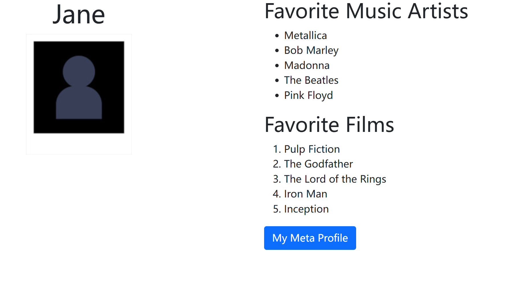

# Course 1 Project Instructions

In this Ungraded Lab, you will update your biographical page from Week 2 - Introduction to HTML5 and CSS to use Bootstrap.

The expected outcome is a two-column biographical page with your name and a photo in the left column and your favorite music artists and films in the right column.

The image below shows how your page should look once you finish the assessment.

