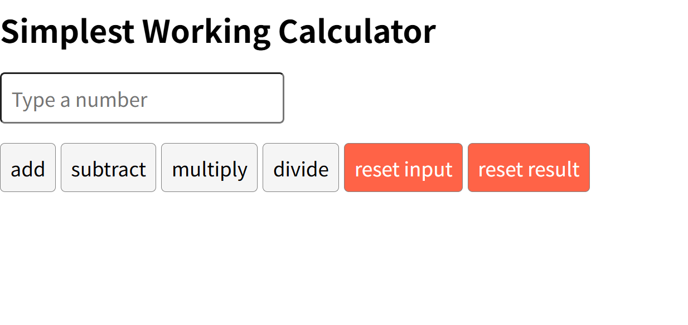

# Course 5: React Basics

Refer to the [course syllabus](./syllabus5.md).

This course project is about using React to build a simple application, a calculator. 

Refer to the [detailed instructions](./instructions5.md).

Complete projects files refer to the [app](./app/). 

To run this React project, you must install React locally by running `npx create-react-app <project name>`, and replace `app.js` and `app.css` with the given files. Then run `npm start`.

## Preview

